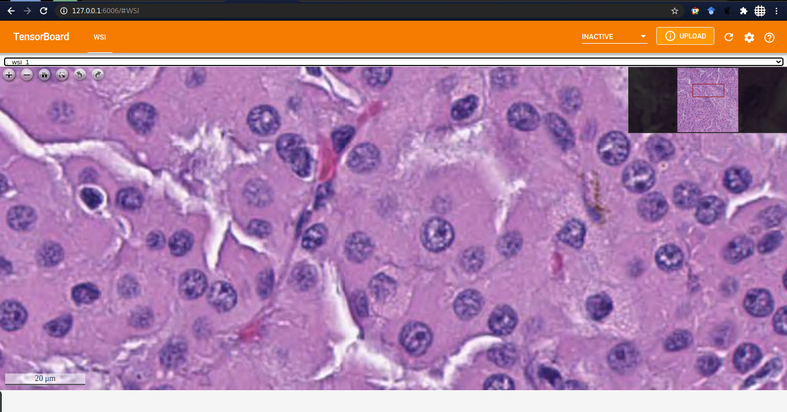

# TensorBoard Plugin for WSI Images

## Setup
```
git clone git@github.com:IAmS4n/TensorBoard_Plugin_WSI.git
cd TensorBoard_Plugin_WSI/
python setup.py install --user
```

## Create a demo log file
```python
import tensorflow as tf
from tensorboard_plugin_wsi import summary_v2

tf.compat.v1.enable_eager_execution()
tf = tf.compat.v2

writer = tf.summary.create_file_writer("demo_logs")
with writer.as_default():
    summary_v2.wsi("wsi_1", "Path to a wsi file")
    summary_v2.wsi("wsi_2", "Path to a wsi file")
```

## Run TensorBoard
The command to run a TensorBoard is normal.
```
tensorboard --logdir demo_logs/
```

## The result
A new tab that you can zoom and analyse the WSIs.
